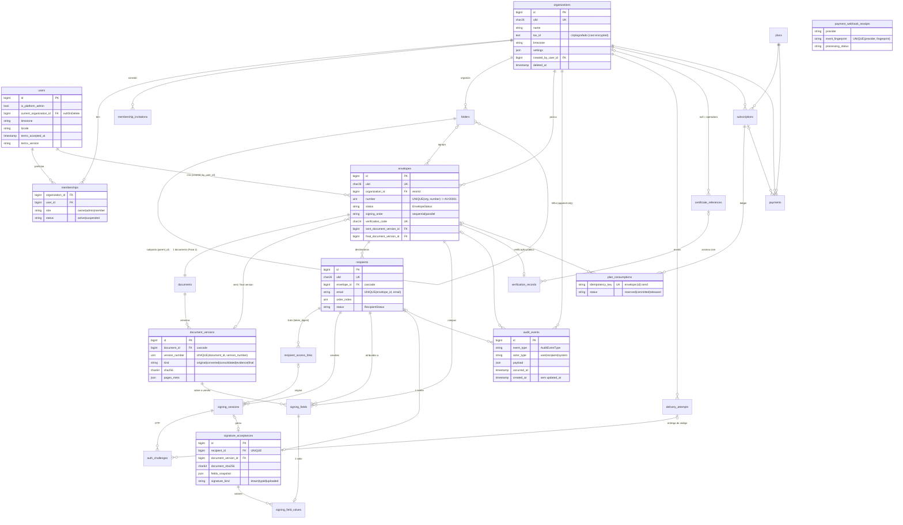

# AssinaVelox — Banco de dados (Fase 1)

> Complementa `docs/arquitetura.md` §3 (contrato de domínio) e `docs/design/RECONCILIACAO.md` (nomes canônicos).
> Alvo: **MySQL 8+/9 (InnoDB, utf8mb4)**. Testes: SQLite em memória. Sem Docker, sem PostgreSQL.

## 1. Visão geral

- Chave interna `id` BIGINT; chave pública `ulid` CHAR(26) UNIQUE (opaca — nunca substitui autorização).
- Todo agregado de negócio carrega `organization_id` (denormalizado onde necessário) e é filtrado pelo escopo global `OrganizationScope` quando há organização corrente (`App\Support\CurrentOrganization`).
- Timestamps em UTC (`timestamp` sem fuso); exibição no fuso da organização (`organizations.timezone`, padrão `America/Sao_Paulo`).
- Dinheiro em centavos inteiros (`*_cents` UNSIGNED INT) + `currency` CHAR(3) (`BRL`).
- Enums de domínio são `VARCHAR(32)` no banco + `enum` PHP 8.3 (`App\Enums\*`) via cast Eloquent (ver §4.1).
- Digests SHA-256 são `CHAR(64)`; códigos de verificação `CHAR(24)` (12 caracteres base32 sem `0/1/O/I`, exibidos `XXXX-XXXX-XXXX`).

## 2. Diagrama (Mermaid)



## 3. Tabelas e migrations

| Migration                                      | Tabelas                                                         | Observações                                                                                                                                  |
| ---------------------------------------------- | --------------------------------------------------------------- | -------------------------------------------------------------------------------------------------------------------------------------------- |
| `0001_01_01_*` (kit)                           | `users`, `password_reset_tokens`, `sessions`, `cache*`, `jobs*` | starter kit                                                                                                                                  |
| `2025_08_14_*` (kit)                           | `users.two_factor_*`                                            | Fortify                                                                                                                                      |
| `100001_create_organizations_table`            | `organizations`                                                 | `tax_id` TEXT criptografado; `settings` JSON; soft delete                                                                                    |
| `100002_add_platform_columns_to_users_table`   | `users` (+colunas)                                              | `is_platform_admin`, `current_organization_id`, `timezone`, `locale`, `terms_accepted_at`, `terms_version`                                   |
| `100003_create_memberships_tables`             | `memberships`, `membership_invitations`                         | UNIQUE(org,user); `token_digest` UNIQUE                                                                                                      |
| `100004_create_folders_table`                  | `folders`                                                       | UNIQUE(org, parent_id, name) — NULL não colide no MySQL; raiz validada no serviço                                                            |
| `100005_create_envelopes_table`                | `envelopes`                                                     | UNIQUE(org, number); `verification_code` UNIQUE; índices (org,status), (org,created_at), (org,folder_id), (org,creator), (status,expires_at) |
| `100006_create_documents_tables`               | `documents`, `document_versions` (+FKs circulares)              | UNIQUE(document_id, version_number); FKs `envelopes.sent/final_document_version_id` e `documents.current_version_id` adicionadas aqui        |
| `100007_create_recipients_table`               | `recipients`                                                    | UNIQUE(envelope_id, email)                                                                                                                   |
| `100008_create_delivery_attempts_table`        | `delivery_attempts`                                             | antes de `auth_challenges` (FK)                                                                                                              |
| `100009_create_recipient_access_links_table`   | `recipient_access_links`                                        | `token_digest` UNIQUE; só `created_at`                                                                                                       |
| `100010_create_signing_sessions_table`         | `signing_sessions`                                              | `token_digest` UNIQUE; só `created_at`                                                                                                       |
| `100011_create_auth_challenges_table`          | `auth_challenges`                                               | `code_hash` HMAC; só `created_at`                                                                                                            |
| `100012_create_signing_fields_table`           | `signing_fields`                                                | geometria DECIMAL(9,6) normalizada                                                                                                           |
| `100013_create_signature_acceptances_table`    | `signature_acceptances`                                         | UNIQUE(recipient_id); só `created_at`                                                                                                        |
| `100014_create_signing_field_values_table`     | `signing_field_values`                                          | UNIQUE(signing_field_id); só `created_at`                                                                                                    |
| `100015_create_audit_events_table`             | `audit_events`                                                  | **append-only**; sem `updated_at`                                                                                                            |
| `100016_create_certificate_references_table`   | `certificate_references`                                        | `secret_ref` = nome da variável/arquivo, nunca o segredo                                                                                     |
| `100017_create_verification_records_table`     | `verification_records`                                          | `code` UNIQUE = `envelopes.verification_code`; `envelope_id` UNIQUE                                                                          |
| `100018_create_plans_table`                    | `plans`                                                         | `code` UNIQUE; `price_cents`                                                                                                                 |
| `100019_create_subscriptions_table`            | `subscriptions`                                                 | uma vigente por org via serviço (sem índice parcial no MySQL)                                                                                |
| `100020_create_plan_consumptions_table`        | `plan_consumptions`                                             | `idempotency_key` UNIQUE                                                                                                                     |
| `100021_create_payments_table`                 | `payments`                                                      | `external_reference` UNIQUE; `provider_payment_id` UNIQUE nullable                                                                           |
| `100022_create_payment_webhook_receipts_table` | `payment_webhook_receipts`                                      | UNIQUE(provider, event_fingerprint)                                                                                                          |
| `100023_create_notifications_table`            | `notifications`                                                 | canal `database` (Laravel)                                                                                                                   |

Todos os nomes de índice/constraint gerados têm menos de 64 caracteres (limite do MySQL); os mais longos receberam nome explícito (`envelopes_sent_version_foreign`, `envelopes_final_version_foreign`, `verification_records_final_version_foreign`, `verification_records_certificate_foreign`, `recipient_access_links_active_index`, `envelopes_org_creator_index`).

## 4. Decisões

### 4.1 `VARCHAR(32)` + enum PHP em vez de `ENUM` SQL

- `ENUM` do MySQL exige `ALTER TABLE` (com cópia da tabela em versões antigas) para cada novo valor e não existe no SQLite usado nos testes.
- A fonte da verdade dos valores é `App\Enums\*` (string-backed), aplicada por cast Eloquent; a validação acontece na aplicação (FormRequests + `Enum::from`).
- Os valores ficam legíveis em consultas SQL diretas e em exportações.

### 4.2 Regras de `ON DELETE`

| Relação                                                                                                                                                                                                                                          | Regra                           | Motivo                                                                                                                                     |
| ------------------------------------------------------------------------------------------------------------------------------------------------------------------------------------------------------------------------------------------------ | ------------------------------- | ------------------------------------------------------------------------------------------------------------------------------------------ |
| `organizations` → `envelopes`, `documents`, `document_versions`, `recipients`, links, sessões, desafios, campos, valores, aceites, `audit_events`, `delivery_attempts`, `verification_records`, `subscriptions`, `plan_consumptions`, `payments` | **RESTRICT**                    | Organização usa soft delete; exclusão física acidental não pode apagar documentos, evidências ou cobrança.                                 |
| `organizations` → `memberships`, `membership_invitations`, `folders`, `certificate_references`                                                                                                                                                   | CASCADE                         | Dados de configuração/participação sem valor probatório.                                                                                   |
| `envelopes` → `documents`, `recipients`, `signing_fields`, `signing_field_values`, `signature_acceptances`, `recipient_access_links`, `signing_sessions`, `auth_challenges`                                                                      | CASCADE                         | Toda a subárvore pertence ao envelope (que também usa soft delete).                                                                        |
| `documents` → `document_versions`                                                                                                                                                                                                                | CASCADE                         | Versões pertencem ao documento.                                                                                                            |
| `document_versions` → links, sessões, campos, aceites                                                                                                                                                                                            | CASCADE                         | Mesma subárvore do envelope; evita conflito de ordem de cascata no InnoDB.                                                                 |
| `document_versions` → `envelopes.sent/final_document_version_id`, `documents.current_version_id`, `verification_records.final_document_version_id`                                                                                               | SET NULL                        | Referências "ponteiro".                                                                                                                    |
| `envelopes` → `verification_records`                                                                                                                                                                                                             | **RESTRICT**                    | Registro público de verificação não pode desaparecer por exclusão do envelope.                                                             |
| `envelopes` → `audit_events`, `delivery_attempts`, `plan_consumptions`                                                                                                                                                                           | SET NULL                        | Trilha, entregas e ledger sobrevivem ao envelope.                                                                                          |
| `signing_sessions`/`auth_challenges` → `signature_acceptances`                                                                                                                                                                                   | SET NULL (colunas nullable)     | Limpeza futura de sessões/desafios não pode destruir o aceite (**divergência** de arquitetura.md, que lista as colunas como obrigatórias). |
| `folders.parent_id`                                                                                                                                                                                                                              | RESTRICT                        | Serviço move/apaga subpastas antes; evita exclusão recursiva acidental.                                                                    |
| `folders` → `envelopes.folder_id`                                                                                                                                                                                                                | SET NULL                        | Envelope volta para a raiz.                                                                                                                |
| `users` → `envelopes.created_by_user_id`                                                                                                                                                                                                         | RESTRICT                        | Autor é parte da evidência.                                                                                                                |
| `users` → `organizations.created_by_user_id`, `folders.created_by_user_id`, `membership_invitations.invited_by_user_id`, `users.current_organization_id`                                                                                         | SET NULL                        | Ponteiros de conveniência.                                                                                                                 |
| `users` → `memberships`                                                                                                                                                                                                                          | CASCADE                         | —                                                                                                                                          |
| `plans` → `subscriptions`, `payments`                                                                                                                                                                                                            | RESTRICT                        | Planos são desativados (`is_active=false`), nunca apagados.                                                                                |
| `subscriptions` → `plan_consumptions`                                                                                                                                                                                                            | RESTRICT; → `payments` SET NULL | Ledger é histórico.                                                                                                                        |

### 4.3 `audit_events` é append-only

- Sem coluna `updated_at`; o model `AuditEvent` lança `LogicException` em `updating`/`deleting`.
- **Privilégios MySQL recomendados** para o usuário da aplicação em produção (o usuário de migrations é outro):

```sql
-- usuário de runtime da aplicação
GRANT SELECT, INSERT, UPDATE, DELETE ON assinavelox.* TO 'assinavelox_app'@'%';
REVOKE UPDATE, DELETE ON assinavelox.audit_events FROM 'assinavelox_app'@'%';
-- (o MySQL não suporta REVOKE parcial de um GRANT em nível de banco;
--  na prática, conceda por tabela: SELECT, INSERT em audit_events e
--  SELECT, INSERT, UPDATE, DELETE nas demais.)
```

Forma explícita por tabela (recomendada):

```sql
GRANT SELECT, INSERT ON assinavelox.audit_events TO 'assinavelox_app'@'%';
-- para cada outra tabela:
GRANT SELECT, INSERT, UPDATE, DELETE ON assinavelox.envelopes TO 'assinavelox_app'@'%';
-- ...
```

- O usuário usado por `php artisan migrate` (DDL) é separado e não é o de runtime.
- Exportação com hash (checkpoint) fica para o comando de auditoria (incremento 6).

### 4.4 Numeração de envelopes por organização

- `envelopes.number` é INT sequencial **por organização** (`UNIQUE(organization_id, number)`), exibido como `AV-00001` (`Envelope::display_code`).
- `Envelope::nextNumberFor($organization)` roda em transação: `SELECT ... FOR UPDATE` na linha da organização (MySQL) e depois `MAX(number)+1` incluindo excluídos (soft delete). O SQLite ignora o lock — os testes verificam apenas a sequência.
- O serviço que cria envelopes deve envolver a criação na mesma transação; fora dela o UNIQUE é a rede de segurança (retentar em `QueryException`).

### 4.5 Escopo por organização

- `App\Models\Concerns\BelongsToOrganization` adiciona o escopo global `OrganizationScope` (filtra por `organization_id` quando `CurrentOrganization` está definido) e preenche `organization_id` no `creating`.
- Fora do escopo (jobs, comandos, admin): `Model::withoutOrganizationScope()` ou `Model::forOrganization($org)`; `CurrentOrganization::runAs($org, fn)` para executar com outra organização.
- **Não** usam o escopo (consultas cruzam organizações ou são públicas): `Membership`, `MembershipInvitation`, `CertificateReference` (`organization_id` nulo = operadora), `VerificationRecord` (página pública `/verificar`), `Plan`, `PaymentWebhookReceipt`, `User`, `Organization`.
- `CurrentOrganization::instance()` garante singleton via `singletonIf`; recomenda-se registrar `$this->app->singleton(CurrentOrganization::class)` no `AppServiceProvider`.

### 4.6 Segredos e dados sensíveis

- `organizations.tax_id`: cast `encrypted` (APP_KEY). Não indexável — busca por CNPJ não é suportada na Fase 1.
- Tokens (links, sessões, autorização) e OTP: só digests (`CHAR(64)`); o valor bruto nunca é persistido.
- `certificate_references.secret_ref`: nome da variável de ambiente/arquivo do PFX; senha e PFX ficam fora do banco.
- `payments.payer_email_masked`: e-mail já mascarado pelo serviço.

### 4.7 Compatibilidade MySQL × SQLite

- Tipos usados: `bigint`, `int unsigned`, `tinyint unsigned`, `smallint unsigned`, `char(n)`, `varchar(n)`, `text`, `json`, `decimal(9,6)`, `decimal(9,3)`, `boolean`, `timestamp` — todos portáveis.
- FKs adicionadas após a criação (dependência circular envelopes ↔ document_versions) funcionam no SQLite via recriação da tabela pelo Laravel e no MySQL via `ALTER TABLE ... ADD CONSTRAINT`.
- Sem índices parciais, sem `ENUM`, sem funções específicas.

## 5. Seeders

| Seeder                   | Ambiente               | Conteúdo                                                                                                                                                                                                                     |
| ------------------------ | ---------------------- | ---------------------------------------------------------------------------------------------------------------------------------------------------------------------------------------------------------------------------- |
| `PlanSeeder`             | qualquer (idempotente) | `free` (5 envelopes/mês, 1 usuário, R$ 0, público); `professional` e `enterprise` como **placeholders** (`is_sandbox=true`, `is_public=false`, "Plano de desenvolvimento — preços fictícios")                                |
| `PlatformAdminSeeder`    | local/testing          | `admin@assinavelox.local` / `password`, `is_platform_admin=true`                                                                                                                                                             |
| `DemoOrganizationSeeder` | local/testing          | "Imobiliária Horizonte Demo" (Profissional sandbox; owner/admin/operador `*@horizonte.demo`) com 13 envelopes em todos os estados; "Consultoria Vega Demo" (Grátis; `*@vega.demo`) com 3. Dados fictícios; senha `password`. |

Execução local (o `.env` aponta para MySQL; para SQLite): `DB_CONNECTION=sqlite DB_DATABASE=database/database.sqlite php artisan migrate:fresh --seed`.
