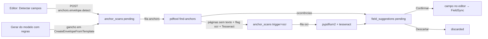

# Detecção de campos por âncoras e OCR (Fase 3 §3.2 — F-ANCHOR)

> Identificadores em inglês; prosa em português. Classe **A** (âncoras em PDF nativo) **+ B**
> (OCR de escaneados, até o Tesseract existir na produção) — `docs/fases-2-3-viabilidade.md` §1.2.
> Nasce atrás das flags `field_anchors` e `ocr`, **desligadas** (roadmap T8).
> Fontes: `docs/roadmap.md` §3.2; `docs/integracoes/pacotes-fase-2-3.md` §5; `docs/arquitetura.md`
> §3.1 (geometria dos campos); `docs/fase-2/modelos.md`.

## 1. O que é, em uma frase

O remetente pede "Detectar campos" (ou gera um documento de um modelo com regras); o `pdftool`
procura **marcadores** `{{assinatura:papel}}` e **textos literais** no PDF e devolve caixas no
mesmo sistema de coordenadas dos campos; o servidor transforma cada ocorrência numa **sugestão**
tracejada no editor, que o remetente **confirma, ajusta ou descarta**. Nada vira campo sozinho, e
o documento não fica pronto enquanto houver sugestão pendente.

## 2. O que o sistema **nunca** faz

- Nunca cria `signing_fields` a partir de uma âncora ou do OCR: confirmar devolve o campo ao
  editor, que o salva pelo caminho de sempre (`PUT envelopes.fields.sync` → `FieldSync`, com toda a
  validação de geometria, papel e flag).
- Nunca envia um documento com sugestão pendente — nem com OCR, nem sem (decisão do roadmap §3.2).
- Nunca compila expressão regular vinda do usuário: o único padrão é a gramática fixa dos
  marcadores; os textos das regras e da busca manual são procurados **literalmente**.
- Nunca executa, interpreta ou exibe como HTML o texto extraído do PDF ou lido por OCR (T6): ele só
  é **comparado**. A resposta do `pdftool` não traz texto do documento — só o tipo do marcador, um
  identificador `[a-z0-9_-]{1,40}` do papel ou o id do literal procurado. O servidor confere de novo
  cada ocorrência (`AnchorMatch::tryFromArray`) e descarta o que sai do contrato.
- Nunca finge OCR: sem o binário a tela diz **"OCR indisponível neste servidor"**. O motor de teste
  (`FakeOcrEngine`) é identificado (`ocr_engine = fake`, "OCR simulado (teste)") e nunca é entregue
  fora dos ambientes `local`/`testing`.
- Nunca deixa uma falha de detecção ou de OCR travar o preparo manual: busca `failed` não bloqueia.

## 3. Fluxo

1. **Pedido.** No editor (passo 3 do wizard), o painel "Detectar campos" chama
   `POST documentos/{envelope}/ancoras/detectar` com os marcadores ligados e até
   `field_anchors.max_literals` (10) textos literais — cada um com tipo de campo, participante
   (opcional) e posição. Uma busca por arquivo pronto (`anchor_scans`, `trigger = manual`). Uma nova
   busca no mesmo arquivo marca as sugestões pendentes anteriores como `superseded`.
2. **Busca** (job `DetectFieldAnchors`, fila `field_anchors.queue` = `anchors`). Copia a versão
   exibível para um temporário exclusivo e roda `pdftool find-anchors` como processo isolado
   (argumentos em array, sem shell, ambiente mínimo, timeout, sem rede). Nenhuma transação fica
   aberta durante o processo.
3. **Sugestões** (`SuggestionBuilder`). Marcador: o campo cobre o marcador (largura ≥ a do marcador,
   centrado na linha). Participante pelo papel do marcador: rótulo do participante (`role_label`,
   comparado sem acentos, "Locatário" = `locatario`), nome ou primeiro nome, ou a posição na lista
   (`1`, `signatario_2`). Papel incompatível (aprovador não recebe assinatura/rubrica) ou sem
   correspondência → sugestão sem participante; o remetente escolhe antes de confirmar.
   `{{texto:nome}}`: `nome` é o rótulo do campo, não um papel. Literal: tipo, participante,
   posição, deslocamento e tamanho vêm do pedido ou da regra. Sugestões que repetem um campo já
   posicionado (mesmo tipo e página, sobreposição > 50 %) ou outra sugestão (> 80 %) não são
   criadas; no máximo `FieldSync::MAX_FIELDS` (200) por busca.
4. **Páginas sem texto** (menos de 8 caracteres). Com `ocr` ligada e o motor disponível, uma segunda
   busca (`trigger = ocr`, `parent_id`) vai para a fila `ocr.queue` (`ocr`), limitada a
   `ocr.max_pages` (20) páginas; senão `documents.ocr_status = unavailable` (servidor sem OCR) ou
   inalterado (OCR fora do plano) — e a tela conta as páginas para o posicionamento manual.
5. **Revisão.** Confirmar (`POST …/sugestoes/{id}/confirmar`, com `recipient_id` opcional) devolve
   o campo no formato do editor e marca a sugestão `accepted` com quem e quando; descartar marca
   `discarded`. "Confirmar as N sugestões do texto" (`…/sugestoes/confirmar-todas`) só leva as do
   **texto do PDF** que já têm participante: as do OCR exigem revisão explícita, uma a uma.

## 4. Regras por modelo

Aba **Âncoras** do editor de modelo (só com as flags `templates` e `field_anchors`). Cada regra:

| Coluna                        | Significado                                                                        |
| ----------------------------- | ---------------------------------------------------------------------------------- |
| `pattern`                     | texto literal (2 a 120 caracteres, com ao menos uma letra ou número)               |
| `field_type`                  | `signature`, `initials`, `name`, `date`, `text`, `checkbox`                        |
| `role_position` / `role_name` | posição 1..N do participante na versão corrente (nulo = escolher ao revisar)       |
| `placement`                   | `below`, `right`, `above`, `over` em relação ao texto                              |
| `offset_x_pt` / `offset_y_pt` | deslocamento em pontos da página exibida (positivo = direita/baixo), ±300          |
| `width_pt` / `height_pt`      | tamanho em pontos (nulo = padrão do tipo; nunca abaixo do mínimo de FieldGeometry) |
| `required`, `occurrence`      | obrigatório; `all` ou só a `first` ocorrência                                      |

- As regras pertencem ao **modelo**, não à versão: salvar regras não cria versão nem altera
  documento já gerado. O participante é achado pela **posição** porque os papéis são imutáveis por
  versão; reordenar os participantes do modelo muda a quem a regra aponta (a tela mostra o nome).
- Ao gerar um envelope do modelo (`CreateEnvelopeFromTemplate`), com a flag ligada e ao menos uma
  regra, uma busca `trigger = template` é agendada **depois do commit** no documento gerado:
  marcadores + os textos das regras, com a posição N ligada ao destinatário criado para o papel N.
  Documento HTML/DOCX ainda convertendo: a busca espera (`wait_attempts` × `wait_seconds`, padrão
  40 × 15 s) e termina `document_not_ready` se a conversão não acabar — sem travar o preparo.
- "Testar no PDF do modelo" (`POST modelos/{template}/ancoras/testar`) conta as ocorrências de cada
  regra e dos marcadores — só para modelos em PDF (os demais só viram PDF ao gerar).

## 5. Bloqueio de "pronto"

`App\Services\Anchors\SuggestionGate`, ligado por **uma linha** em cada ponto:

- `App\Services\Documents\EnvelopeReadiness::completeness()` — `fields` só é completo sem
  sugestão pendente nem busca em andamento (quem grava o status; o envio recalcula sob lock);
- `App\Services\Envelopes\EnvelopeReadiness::issues()` — a pendência aparece no passo 4:
  "Há N campos sugeridos aguardando revisão. Confirme ou descarte no passo 3."

Contam só as sugestões da **versão exibível corrente** de cada documento, e só as buscas `pending`
ou `running` criadas há menos de `field_anchors.stale_minutes` (15). Com a flag global desligada o
gate volta **antes de qualquer consulta**; com a global ligada e o plano sem o recurso, também não
bloqueia (sem a interface o remetente não teria como revisar; sugestão ignorada nunca vira campo).

## 6. OCR (classe B)

- Contrato `App\Integrations\Ocr\OcrEngine` (`name`, `isFake`, `availability`, `detect`), resolvido
  por `OcrEngines::make()` (instância ligada no contêiner vence; senão `ocr.driver`).
- `TesseractOcrEngine`: disponível só se `ocr.tesseract_path` aponta para um arquivo que responde
  `--list-langs` dentro de `ocr.probe_timeout_seconds` listando `ocr.language` (`por`). Resultado
  em cache por `ocr.probe_cache_minutes` (a chave inclui caminho e data do binário). O
  `pdftool find-anchors --ocr` rasteriza cada página sem texto com pypdfium2 (CropBox exibido,
  rotação aplicada, `ocr.dpi` 200, teto de 30 MP) e roda
  `tesseract <png> stdout -l por --psm 3 tsv` por `subprocess` (lista de argumentos, sem shell,
  `ocr.page_timeout_seconds` por página, ambiente mínimo com `OMP_THREAD_LIMIT=1`, sem rede).
  As caixas por palavra do TSV já estão no sistema da página exibida.
- `documents.ocr_status`: `not_needed` (todas as páginas com texto) | `pending` | `done` | `failed` |
  `unavailable`; nulo = nunca avaliado (flags desligadas).
- Falha numa página vira `ocr: failed` naquela página e não derruba a busca; falha do motor marca
  a busca `failed` e o documento `failed`. Nenhuma das duas bloqueia o preparo.
- Fila própria (`ocr`), uma tentativa só (repetir um OCR que estourou o tempo só gasta mais CPU).
- **Tempo** (revisão adversarial da onda F): o orçamento `--time-budget` vale para a busca inteira —
  conferido entre páginas, a cada 512 glifos dentro da página (o agrupamento em linhas agora é
  O(n log n), com soma acumulada por linha) e antes de cada OCR, com o tesseract limitado a
  `min(ocr.page_timeout, orçamento restante)`. Página com mais de 60 000 glifos é recusada
  (`too_many_glyphs`). O timeout do processo PHP é `orçamento + 30 s + page_timeout` com OCR, então
  o Python nunca é morto no meio de um tesseract; o tesseract roda em sessão própria (POSIX) e é
  morto se o Python receber SIGTERM. "Testar regras" do modelo, que roda DENTRO da requisição HTTP,
  usa orçamento curto (`field_anchors.test_time_budget_seconds`, 15 s; processo morto em 45 s, sem o
  piso de 90 s da fila).

## 7. Coordenadas (prova)

As caixas saem no sistema de `FieldGeometry` (frações do CropBox **exibido**, depois de `/Rotate`,
origem no canto superior esquerdo). O pdfplumber entrega os glifos num espaço "MediaBox
rotacionada" do pdfminer; o `pdftool` desfaz a CTM de página do pdfminer (`pdfminer_to_user`) e
leva cada canto ao CropBox exibido com `user_to_displayed`, o inverso exato de
`geometry.displayed_to_user` (teste de ida e volta nas 4 rotações e com CropBox deslocado).

- `tools/pdftool/tests/test_anchors.py`: marcador desenhado em (100, 700) pelo reportlab, nas
  rotações 0/90/180/270, com CropBox e MediaBox deslocados — a caixa devolvida, convertida de volta
  com `normalized_to_pdf_rect`, cobre o ponto e começa em x = 100.
- `tests/Feature/Phase3/Anchors/DetectionTest.php`: a mesma prova do lado do PHP — a caixa do
  `find-anchors` real passa por `FieldGeometry::toPdfRect` com o `pages_meta` do `pdftool inspect`
  e cobre o ponto desenhado, nas 4 rotações e com CropBox deslocado.

## 8. Contratos

### Rotas (JSON; 404 com a flag desligada; autorização `update` do envelope/modelo)

| Método | URI                                               | Nome                             |
| ------ | ------------------------------------------------- | -------------------------------- |
| GET    | `documentos/{envelope}/ancoras`                   | `anchors.envelope.index`         |
| POST   | `documentos/{envelope}/ancoras/detectar`          | `anchors.envelope.detect`        |
| POST   | `documentos/{envelope}/sugestoes/confirmar-todas` | `anchors.suggestions.accept_all` |
| POST   | `documentos/{envelope}/sugestoes/{id}/confirmar`  | `anchors.suggestions.accept`     |
| POST   | `documentos/{envelope}/sugestoes/{id}/descartar`  | `anchors.suggestions.discard`    |
| GET    | `modelos/{template}/ancoras`                      | `anchors.template.index`         |
| PUT    | `modelos/{template}/ancoras`                      | `anchors.template.update`        |
| POST   | `modelos/{template}/ancoras/testar`               | `anchors.template.test`          |

Estado do painel (`AnchorPresenter::envelope`, tipo `AnchorState` em
`resources/js/components/anchors/types.ts`): `busy`, `pending_count`, `ocr {enabled, available,
engine, simulated, message}`, `documents[] {id, ocr_status, ocr_status_label, last_scan,
last_ocr_scan}`, `suggestions[] {id, document_id, page, type, x, y, w, h, required, label,
recipient_id, role_hint, source, via, confidence, requires_explicit_review}`, `limits`,
`placements`, `field_types`.

### Props compartilhadas e TS

`features.field_anchors` e `features.ocr` (`HandleInertiaRequests::features()` via
`AnchorFeatures::forOrganization`); chaves opcionais em `resources/js/types/index.ts`.

### Front

- `resources/js/components/anchors/`: `use-anchor-suggestions.ts` (estado + consulta a cada 3 s
  enquanto há busca em andamento), `anchor-suggestion-layer.tsx` (caixas tracejadas "Sugerido" na
  página), `anchor-suggestions-panel.tsx` (painel e diálogo "Detectar campos"),
  `anchor-rules-editor.tsx` (aba "Âncoras" do modelo), `http.ts`, `types.ts`.
- Ganchos: `wizard-step-fields.tsx` (hook + camada + painel, ~25 linhas) e `templates/edit.tsx`
  (aba, ~10 linhas).

### Trilha

**Nenhum evento novo em `audit_events`.** `tests/Unit/Models/EnumCatalogTest.php` fixa a lista
exata de `AuditEventType` e a regra desta onda proíbe mudar asserções existentes. A revisão fica
registrada nas próprias tabelas: `anchor_scans.requested_by_user_id` (quem pediu, quando, o quê) e
`field_suggestions.resolved_by_user_id/resolved_at/status` (quem confirmou ou descartou). O campo
confirmado entra na trilha do envelope pelo `fields.updated` do `FieldSync`, como qualquer campo.
Promover esses registros a eventos (`anchors.scan_*`, `field_suggestion.*`) exige atualizar o
catálogo da reconciliação e o `EnumCatalogTest` — decisão para a integração da onda.

## 9. Tabelas (migrations 2026_09_14_160101–160104, aditivas)

- `field_anchor_rules` — regras do modelo (§4).
- `anchor_scans` — buscas (`trigger` manual | template | ocr; `status` pending | running | done |
  failed; `query` com o que foi procurado — nunca o texto do documento; `ocr_engine`;
  `pages_without_text`; contagens; `failure_code`). `document_version_id` anulável enquanto o
  documento de um modelo HTML/DOCX converte.
- `field_suggestions` — sugestões (`status` pending | accepted | discarded | superseded; `source`
  marker | rule | literal; `via` text | ocr; geometria DECIMAL(9,6); `role_hint`; `confidence`).
- `documents.ocr_status` — anulável.

## 10. Configuração (`config/assinavelox.php`)

`features.field_anchors`, `features.ocr` (ambas `false`); seções `field_anchors` (fila, tempos,
limites de páginas/tamanho/ocorrências/literais/regras, `stale_minutes`, espera da conversão) e
`ocr` (`driver`, fila, `tesseract_path`, `tessdata_prefix`, idioma, DPI, tempo por página, máximo
de páginas, verificação). Variáveis `ASSINAVELOX_FEATURE_FIELD_ANCHORS`, `ASSINAVELOX_FEATURE_OCR`,
`ASSINAVELOX_ANCHORS_*`, `ASSINAVELOX_OCR_*`.

## 11. O que falta para ligar em produção

**`field_anchors` (classe A)** — pronto para ligar por plano depois de:

1. worker para a fila `anchors` (`php artisan queue:work --queue=anchors`, ou a fila no Horizon);
2. o `pdftool` da produção com `pdfplumber` 0.11.10 e `pypdfium2` 5.13.0 (já no
   `requirements.lock.txt`);
3. QA manual no navegador com PDFs reais do cliente (marcadores, textos literais, página
   rotacionada) — nesta onda não há teste de navegador do painel;
4. decisão de trilha (§8): manter nas tabelas próprias ou promover a `audit_events`.

**`ocr` (classe B)** — depende do proprietário:

1. instalar o Tesseract 5.5.x + `por.traineddata` (`tessdata_fast`) no servidor (Debian/Ubuntu:
   `tesseract-ocr tesseract-ocr-por`; Windows: instalador da UB Mannheim) e configurar
   `ASSINAVELOX_OCR_TESSERACT_PATH` (e `ASSINAVELOX_OCR_TESSDATA_PREFIX`, se preciso);
2. worker para a fila `ocr`, dimensionado para CPU (uma página a 200 DPI leva segundos);
3. limite de custo por plano (hoje só `ocr.max_pages` por passagem e o `throttle:10,1` da busca);
4. **a meta do roadmap — ≥ 90 % das âncoras em escaneado legível — não foi medida**: exige o
   Tesseract instalado e uma fixture real (§12).

## 12. Como medir a meta de 90 % (pendência do proprietário)

1. Monte uma pasta com escaneados **representativos** (papel real, 200–300 DPI, alguns tortos),
   cada um acompanhado de um `.json` com as âncoras esperadas: `[{"page": 1, "key": "locatario",
"field_type": "signature"}, …]` para marcadores e `[{"page": 1, "literal": "Assinatura do
locatário"}]` para textos.
2. Para cada PDF, rode (com o Tesseract instalado):
   `tools/pdftool/.venv/bin/python -m pdftool find-anchors --in escaneado.pdf --spec spec.json
--ocr --tesseract /usr/bin/tesseract --ocr-lang por --ocr-dpi 300`.
3. Conte como acerto a âncora esperada que aparece em `matches` na página certa (mesmo `key` e
   `field_type`, ou o `literal_id` correspondente). Taxa = acertos ÷ âncoras esperadas, somando
   todos os arquivos; registre também os falsos positivos (ocorrências que não estavam no gabarito).
4. Meta: ≥ 90 %. Abaixo disso, ajuste primeiro `--ocr-dpi` (300) e a qualidade do escaneamento;
   depois considere `--psm 6` (bloco uniforme) — hoje fixo em `3` no `pdftool`.

## 13. Testes

- `tools/pdftool/tests/test_anchors.py` (51): inverso da geometria, marcador nas 4 rotações, CropBox
  e MediaBox deslocados, texto fora do CropBox, várias ocorrências em várias páginas, gramática
  (maiúsculas, acentos, espaços, marcadores inválidos), marcador quebrado em duas linhas, literal
  normalizado com limite de palavra, literal nunca é expressão regular, saída sem texto do
  documento, página sem texto, PDF criptografado/corrompido/ausente, limites de páginas, tamanho,
  tempo e ocorrências, spec inválido, OCR com Tesseract simulado (rotação 0/90, literal em várias
  palavras e linhas, falha por página, limite de páginas, binário ausente, idioma inválido, TSV).
- `tests/Feature/Phase3/Anchors` (Pest): `FlagOffTest` (rotas 404, plano, `ocr` sem
  `field_anchors`, nenhuma consulta nova no preparo, sugestão não trava com a flag desligada),
  `GeometryTest` (posicionamento, slug do papel igual ao do pdftool, conferência da saída),
  `DetectionTest` (marcadores → sugestões e bloqueio, prova da geometria no PHP nas 4 rotações,
  literal, confirmar/descartar/confirmar todas, participante obrigatório e papéis, nova busca
  substitui, duplicata de campo existente, PDF criptografado, página sem texto, validação, envelope
  enviado), `OcrTest` (indisponível sem Tesseract, verificação real do binário, OCR simulado com
  revisão explícita, falha do OCR, motor simulado fora de testing, busca parada), `TemplateRulesTest`
  (CRUD, validação, teste no PDF do modelo, uso do modelo agenda a busca, sem regras/flag desligada,
  outra organização) e `IsolationTest` (outro envelope, outra organização, sem permissão, convidado).
